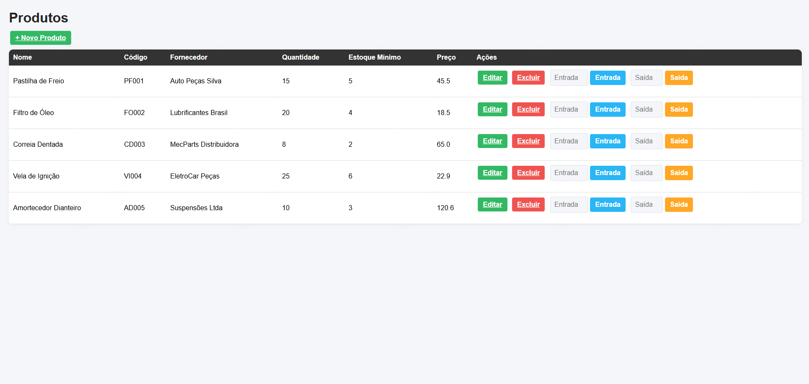

# Sistema Web de Controle de Estoque

## Contexto

Este projeto acadêmico foi desenvolvido para atender às necessidades de uma oficina mecânica, visando informatizar o controle de peças e insumos. O sistema permite o cadastro, movimentação e monitoramento de produtos, proporcionando maior organização, agilidade e precisão na gestão do estoque.

---

## Preview das Telas

> - Tela de listagem de produtos



> - Tela de cadastro de produto
> - Tela de edição de produto
> - Alerta de estoque mínimo

---

## Funcionalidades

- Cadastro de produtos (nome, código, fornecedor, quantidade, estoque mínimo, preço, data de cadastro)
- Listagem de todos os produtos em tabela
- Edição e exclusão de produtos
- Registro de entrada e saída de estoque
- Validação automática para impedir saída maior que a quantidade disponível
- Alerta visual para itens com quantidade igual ou inferior ao estoque mínimo
- Interface web intuitiva e responsiva

---

## Tecnologias Utilizadas

- **Python 3**
- **Flask** (framework web)
- **SQLite** (banco de dados)
- **HTML5 / CSS3**
- **Jinja2** (templates Flask)

---
## Como Executar

### Pré-requisitos

- Python 3 instalado
- pip instalado

### Passo a Passo

1. Clone o repositório:
    ```bash
    git clone https://github.com/seuusuario/projeto-estoque.git
    cd projeto-estoque
    ```

2. Crie e ative um ambiente virtual (opcional, mas recomendado):
    ```bash
    python -m venv venv
    venv\Scripts\activate   # Windows
    source venv/bin/activate # Linux/Mac
    ```

3. Instale as dependências:
    ```bash
    pip install flask
    ```

4. Inicialize o banco de dados:
    ```bash
    python init_db.py
    ```

5. Execute o sistema:
    ```bash
    python app.py
    ```

6. Acesse no navegador:
    ```
    http://127.0.0.1:5000
    ```

---

## Objetivo do Projeto

Desenvolver um sistema web funcional e didático para o controle de estoque, aplicando conhecimentos de lógica de programação, banco de dados, desenvolvimento web e documentação técnica. O projeto visa solucionar um problema real identificado em uma oficina mecânica, substituindo métodos manuais por uma ferramenta interativa e eficiente.

---

## Melhorias Futuras

- Dashboard de indicadores de estoque
- Histórico de movimentações
- Autenticação de usuários
- Implantação online (cloud)
- Integração com sistemas de vendas

---

## Autor

- Victor Pinheiro
- Projeto Integrador - Lógica de Programação
- Universidade [Nome]
- Ano: 2026

---

## Licença

Projeto acadêmico, sem fins comerciais.
